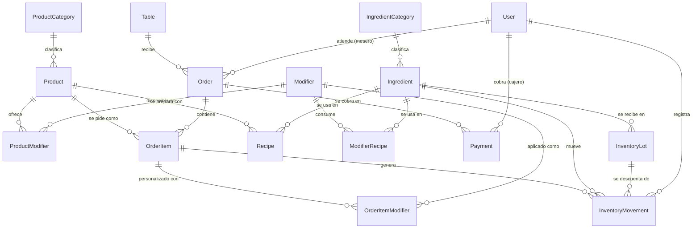

# Modelo de datos — Mokka Café

> Contexto de negocio: [`project-context.md`](./project-context.md). Este documento explica **qué tablas existen, cómo se relacionan, y por qué se diseñaron así** — el complemento de lectura humana a [`backend/prisma/schema.prisma`](../backend/prisma/schema.prisma), que sigue siendo la fuente de verdad técnica.

## Diagrama de relaciones

*(Este diagrama se renderiza automáticamente en GitHub. Muestra solo entidades y relaciones — el detalle de campos está en las tablas de abajo.)*

---

## Tablas por área

### Menú

| Tabla | Propósito | Campos clave |
|---|---|---|
| `product_categories` | Catálogo normalizado de categorías de menú (ej. "Bebidas Calientes", "Postres"). | `name` (único) |
| `products` | Catálogo de venta (ya existía antes de esta pasada). | `priceCents`, `categoryId`, `isAvailable` |
| `modifiers` | Catálogo de personalizaciones con precio propio (ej. "Extra Shot", "Leche de Almendra"). Reutilizable entre productos. | `name`, `priceCents`, `isActive` |
| `product_modifiers` | Qué modificadores están disponibles para qué producto (catálogo, no parte de un pedido todavía). | `productId`, `modifierId` — único por par |

### Pedidos y pagos

| Tabla | Propósito | Campos clave |
|---|---|---|
| `orders` | Una visita de mesa. Vive mientras la mesa esté activa; puede tener varias rondas de pago. | `tableId` (nullable), `orderType`, `waiterId`, `openedAt`/`closedAt` |
| `order_items` | Cada línea pedida. Lleva su **propio estado de cocina** (ver más abajo) y el precio congelado al momento del pedido. | `productId`, `quantity`, `unitPriceCents`, `discountCents`, `status`, `notes` |
| `order_item_modifiers` | Personalizaciones realmente aplicadas a un ítem del pedido, con su precio congelado. | `orderItemId`, `modifierId`, `priceCentsAtOrder`, `quantity` |
| `payments` | Un cobro. Un `order` puede tener **varios** `payments` (rondas, o métodos distintos dentro de la misma ronda). | `orderId`, `amountCents`, `method`, `tipCents`, `cashierId`, `voidedAt` |

### Mesas y personal

| Tabla | Propósito | Campos clave |
|---|---|---|
| `tables` | Mesas físicas del local. | `number` (único), `label`, `capacity` |
| `users` | Personal del sistema. | `email` (único), `passwordHash`, `role` (`MESERO`/`CAJERO`/`ADMIN`) |

### Inventario

| Tabla | Propósito | Campos clave |
|---|---|---|
| `ingredient_categories` | Catálogo normalizado de categorías de insumo (ej. "Lácteos", "Café", "Desechables"). | `name` (único) |
| `ingredients` | Insumo/materia prima — incluye tanto ingredientes crudos (café en kg, leche en litros) como productos terminados vendibles (croissants, vasos). | `unit`, `categoryId`, `currentStockQty` (caché), `minStockThreshold` |
| `inventory_lots` | Cada lote/compra de un insumo, con su propia fecha de caducidad y costo. Es el nivel real donde se rastrea el stock. | `ingredientId`, `quantityReceived`/`quantityRemaining`, `unitCostCents`, `expiresAt`, `discountPercent` |
| `recipes` | Cuánto de un insumo consume un producto al venderse. | `productId`, `ingredientId`, `quantityPerUnit` — único por par |
| `modifier_recipes` | Cuánto de un insumo consume un modificador **aditivo** al aplicarse (ej. "Extra Shot" → +18g de café). | `modifierId`, `ingredientId`, `quantityPerUnit` — único por par |
| `inventory_movements` | Libro contable inmutable de toda entrada/salida de stock. | `type` (`ENTRY`/`SALE`/`WASTE`/`ADJUSTMENT`), `ingredientId`, `lotId`, `relatedOrderItemId`, `performedById` |

---

## Decisiones de diseño y por qué

### 1. El estado de preparación vive en `OrderItem`, no en `Order`

Un pedido real puede tener una ronda ya entregada y pagada, mientras se le agregan ítems nuevos que apenas empiezan — ambas cosas son ciertas *a la vez* dentro del mismo `Order`. Un solo campo `status` en `Order` no puede representar eso. Por eso cada `OrderItem` avanza su propio ciclo: `RECEIVED → IN_PREPARATION → READY → DELIVERED`. `Order` solo describe si la visita a la mesa sigue abierta (`openedAt`/`closedAt`).

Esto además coincide exactamente con el nivel de detalle que ya construimos en el mock de Cocina, donde cada ítem tiene su propio check individual.

### 2. Vencimientos se rastrean por lote (`InventoryLot`), no con una bandera simple

Se evaluaron dos opciones: una bandera de "por vencer" directamente en `Ingredient`, o una entidad de lote separada. Se eligió lote porque una bandera **no es un primer paso hacia los lotes — es un modelo distinto** que requeriría reescritura, no ampliación: una cafetería real compra leche en lotes con fechas de vencimiento distintas entre sí, y una bandera en el insumo agregado no puede capturar eso sin partir el stock retroactivamente después. Los lotes también destraban costeo real (FIFO/FEFO) para el reporte de "Ingresos vs Costos", y encajan naturalmente con que los productos no vendidos simplemente se guarden para el día siguiente (los lotes persisten entre días sin lógica especial).

### 3. Los modificadores tienen precio propio, no son solo texto libre

El mock de POS muestra "+ Leche de Almendra" y "+ Extra Shot" en los tickets. Se modelaron como `Modifier` con `priceCents` (en vez de texto plano) porque afectan el ingreso real y deben poder reportarse — "cuánto se vendió en extras" es una pregunta de negocio válida. `OrderItem.notes` se mantiene aparte para pedidos puntuales que no ameritan su propia entrada de catálogo (ej. "sin hielo").

### 4. Los precios se congelan al momento del pedido

`OrderItem.unitPriceCents` y `OrderItemModifier.priceCentsAtOrder` son una copia del precio en ese instante, no una referencia viva a `Product.priceCents`/`Modifier.priceCents`. Sin esto, subir el precio de un café el mes que viene reescribiría silenciosamente el total de todos los pedidos históricos que lo incluyeron — un bug de integridad de datos, no un detalle menor.

### 5. `Order.tableId` es opcional

`orderType` ya soporta `TAKEAWAY`/`DELIVERY` desde el día uno (aunque hoy no se usen) para no requerir una migración rompiente después. `tableId` sigue la misma lógica: si fuera obligatorio, un pedido para llevar necesitaría una mesa falsa. La regla real — "dine-in requiere mesa" — se valida en la entidad de dominio (mismo patrón que las validaciones de `Product.create()`), no en la base de datos.

### 6. Todo insumo de venta directa (ej. croissant) es también su propio `Ingredient`

Un croissant se vende directo en el POS, pero también es stock finito horneado. Convención: tiene su propio registro en `ingredients` con el mismo nombre, más una fila en `recipes` con `quantityPerUnit = 1` apuntando a sí mismo. Así la deducción de inventario es un solo camino de código (`Recipe` → `InventoryLot`) sin importar si el producto se prepara (un latte = granos + leche + vaso) o se vende tal cual.

### 7. `InventoryMovement` apunta a `OrderItem`, no a `Order`

Un pedido puede tener varios ítems con productos distintos. Si el movimiento de inventario solo referenciara el `Order`, se perdería la trazabilidad de qué línea específica generó qué descuento de insumo — necesario tanto para auditoría como para reportes de consumo por producto.

### 8. Los saldos (`currentStockQty`, `quantityRemaining`) son caché, no la fuente de verdad

`inventory_movements` es el libro contable inmutable. Los saldos denormalizados existen porque recalcular con `SUM()` en cada venta (ruta caliente del sistema) sale caro. Regla no negociable para cuando se construya el caso de uso: **todo insert de un movimiento y su actualización de saldo van en la misma transacción de Prisma** — nunca por separado, o los dos números divergen con el tiempo.

### 9. Los roles existen como enum; los permisos exactos, no todavía

`User.role` (`MESERO`/`CAJERO`/`ADMIN`) alcanza para modelar quién es quién. Qué puede hacer cada rol sigue pendiente de confirmar con el cliente (`project-context.md` §2) — es una capa de autorización aparte, no algo que el esquema deba resolver hoy.

### 10. `category` se normalizó a `product_categories` / `ingredient_categories`

Antes eran `String` libres en `Product` e `Ingredient`. Con texto libre, dos personas cargando el catálogo terminan con `"Bebidas Calientes"` y `"bebida caliente"` como si fueran categorías distintas, y el filtro de menú se vuelve poco confiable. Se separaron en dos tablas (no una compartida) porque son dominios distintos: una es cara al cliente (navegación del menú), la otra es interna (reportes de costo por tipo de insumo) — compartir tabla solo complicaría validar qué categorías aplican a qué lado.

### 11. Los modificadores **aditivos** también descuentan inventario, vía `modifier_recipes`

"Extra Shot" o "Extra Queso" consumen insumo real y antes no tenían forma de reflejarlo. `ModifierRecipe` sigue el mismo patrón que `Recipe` (`modifierId`, `ingredientId`, `quantityPerUnit`) para que la deducción de inventario al vender sea: recorrer `Recipe` del producto **más** `ModifierRecipe` de cada modificador aplicado, generando `InventoryMovement`s de ambos.

Deliberadamente no cubre el caso **sustitutivo** (ej. "Leche de Almendra" en vez de leche regular, que debería reemplazar un ingrediente de la receta base en vez de sumarse a ella) — requeriría marcar qué ingrediente reemplaza cada modificador, y no hay todavía un caso de negocio confirmado que lo necesite. Se resuelve ampliando `ModifierRecipe` cuando aparezca, no rediseñando.

### 12. `OrderItemStatus.CANCELLED` y `Payment.voidedAt`

Antes no había forma de representar que un ítem se cancela después de entrar a cocina, ni que un cobro se anula tras registrarse (error de caja, cliente se retracta). Ambos se modelaron como estado adicional en vez de borrar la fila — igual que los precios congelados (decisión 4), el registro histórico no debe desaparecer. La reversión de inventario cuando se cancela un `OrderItem` ya con stock descontado se resuelve con un `InventoryMovement` tipo `ADJUSTMENT` (no hizo falta un tipo nuevo).

### 13. Pedidos en línea: preparado, pero deliberadamente no implementado

Se evaluó si el modelo soporta un pedido hecho directo por el cliente (web/app), sin mesero ni cajero físico de por medio. No se implementa todavía — no hay caso de negocio confirmado — pero se dejó registrado que el camino hacia ahí es **aditivo**, no un rediseño, siguiendo la misma filosofía de la decisión 5:

- `Order.waiterId` y `Payment.cashierId` son obligatorios hoy porque todo pedido pasa por personal del local. El día que existan pedidos en línea, ambos se relajan a nullable — relajar un `NOT NULL` a nullable no necesita backfill ni rompe filas existentes.
- Faltaría una entidad `Customer` (nombre, teléfono, dirección) y un `customerId` nullable en `Order` — tabla nueva más columna nullable, aditivo.
- El pago dejaría de ser "cajero registra un cobro ya confirmado" para pasar a ser un gateway externo con estado asíncrono (`pending`/`approved`/`rejected`) y un ID de transacción — se resuelve con columnas nuevas en `Payment` (ej. `externalReference`, `gatewayStatus`), no con un rediseño de la tabla.

Lo único que vale la pena fijar **ahora**, aunque no se construya nada: cuando llegue el momento, el **origen del pedido** (POS / web / app / marketplace) debe modelarse aparte de `OrderType`, que solo describe el fulfillment (`DINE_IN`/`TAKEAWAY`/`DELIVERY`). Mezclar ambos conceptos en un solo enum llevaría a una explosión combinatoria (`TAKEAWAY_WEB`, `TAKEAWAY_POS`, ...) en vez de dos ejes ortogonales. No se agrega el campo hoy porque nada lo usa todavía, pero cualquier implementación futura de pedidos en línea debería respetar esa separación en vez de forzarla dentro de `OrderType`.

---

## Flujo de una venta, de punta a punta

1. Mesero abre un `Order` (mesa + `orderType = DINE_IN`).
2. Agrega `OrderItem`s con su precio congelado, más `OrderItemModifier`s si aplica. Cada ítem nace en `RECEIVED`.
3. Cocina avanza el `status` de cada `OrderItem` de forma independiente — esto alimenta el tablero de Cocina.
4. Al vender un ítem, se resuelve su `Recipe`, se elige lote por FEFO (el `InventoryLot` con `expiresAt` más próximo primero) y se generan `InventoryMovement`s tipo `SALE`, descontando `quantityRemaining` del lote y `currentStockQty` del insumo, todo en una transacción.
5. Si el lote usado está marcado con `discountPercent`, ese descuento queda en `OrderItem.discountCents`.
6. Caja cobra: crea un `Payment` por esa ronda. El `Order` sigue abierto — pueden agregarse ítems nuevos después sin afectar los ya entregados/pagados.
7. Cuando todo está pagado, se fija `Order.closedAt`.

---

## Qué queda deliberadamente fuera (no bloqueado, solo no construido)

- **Autenticación** (login, hashing, sesión/JWT) — `User.passwordHash` existe, el flujo no.
- **Permisos exactos por rol** — pendiente de confirmar con el cliente.
- **Entidad `Supplier`** — hoy es un `String` simple en `InventoryLot`; se separa si el cliente confirma que necesita más que un nombre.
- **División de cuenta** — el modelo no la bloquea (varios `Payment`s por `Order` ya lo permite en esencia), pero no se diseñó su flujo especial.
- **Multi-sucursal** — nada en el esquema lo impide; agregar un `branchId` nullable después sería aditivo en la mayoría de las tablas. La excepción es `Table.number`, que hoy es `@unique` **global**: dos sucursales no podrían tener cada una una "Mesa 5". Al agregar `branchId` ese `@unique` debe volverse compuesto (`@@unique([branchId, number])`) — no se pierden datos al migrarlo, pero sí es un cambio de restricción real, no un simple `ALTER TABLE ADD COLUMN`.
- **Modificadores sustitutivos** (reemplazan un ingrediente de la receta base en vez de sumarse) — ver decisión 11. `ModifierRecipe` cubre el caso aditivo; el sustitutivo espera un caso de negocio real.
- **Conversión de unidades entre `Ingredient.unit` y `Recipe`/`ModifierRecipe.quantityPerUnit`** — el esquema asume que quien carga una receta usa la misma unidad que el insumo (ej. ambos en gramos). No hay tabla de conversión; se valida a mano al cargar el catálogo. Se agrega si aparecen recetas que mezclan unidades del mismo insumo.
- **Mesas fusionadas** (un grupo grande ocupando dos mesas físicas como un solo pedido) — `Order.tableId` sigue siendo una sola mesa. No es un cambio aditivo trivial (implica un concepto de "grupo de mesas"), así que se deja fuera hasta confirmar que el negocio lo necesita.
- **Reembolso parcial de un `Payment`** — `voidedAt` (decisión 12) cubre anular el pago completo; un reembolso parcial (ej. devolver solo el tip) necesitaría su propio monto y no está modelado todavía.
- **Selección de lote a través de múltiples `InventoryLot` en una sola venta** (FEFO cuando el lote más próximo no alcanza la cantidad pedida) — el esquema ya lo permite generando varios `InventoryMovement` para el mismo `OrderItem`, pero es lógica que debe vivir explícitamente en el use case de venta, no algo automático de la base de datos.
- **Pedidos en línea** (cliente pide directo por web/app, sin mesero ni cajero físico) — ver decisión 13. No está bloqueado: los cambios que haría falta agregar (`waiterId`/`cashierId` nullable, entidad `Customer`, campos de gateway en `Payment`) son todos aditivos.
- **Los módulos hexagonales de NestJS** (repositorios/casos de uso/controllers) para cada entidad nueva — se construyen feature por feature. El candidato natural siguiente es `Order`/`OrderItem`, para conectar el POS ya construido en el frontend.

## Nota

`docs/project-context.md` menciona solo efectivo y QR como métodos de pago, pero tanto el mock de POS como `PaymentMethod` en el esquema ya incluyen tarjeta (`CARD`) — vale la pena actualizar ese documento para que quede consistente.
